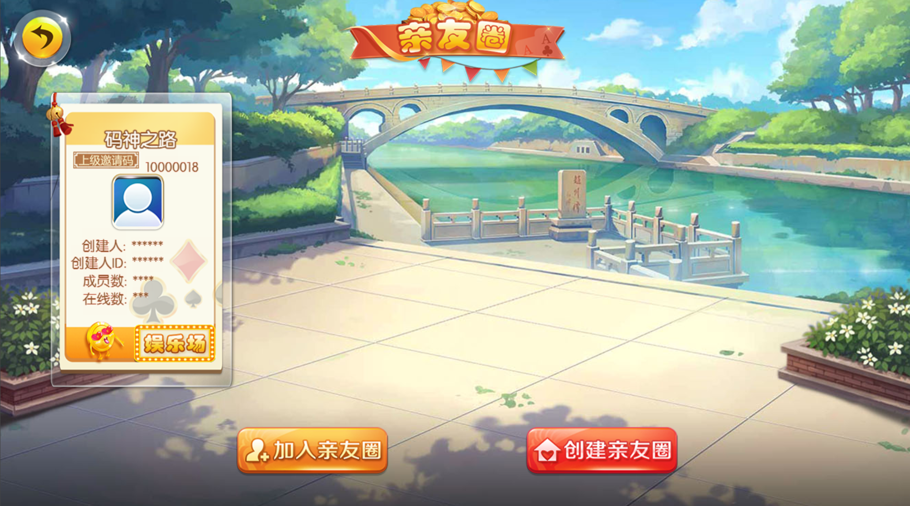
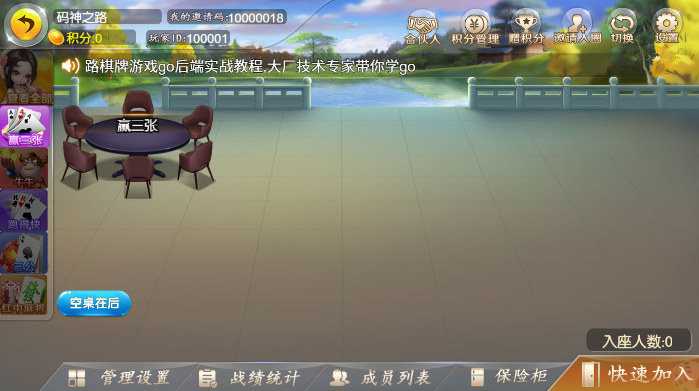
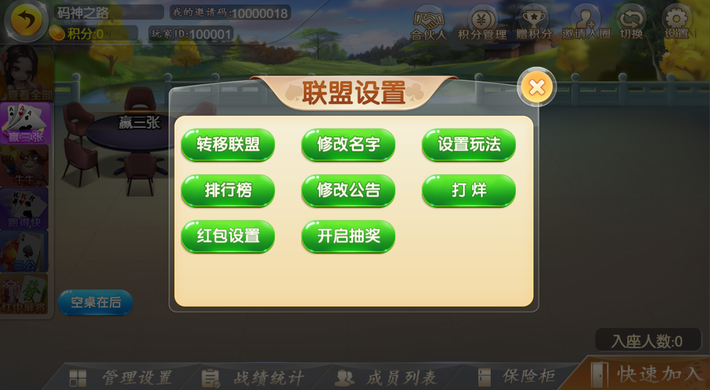
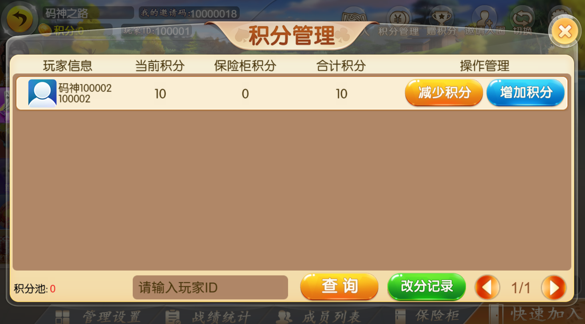
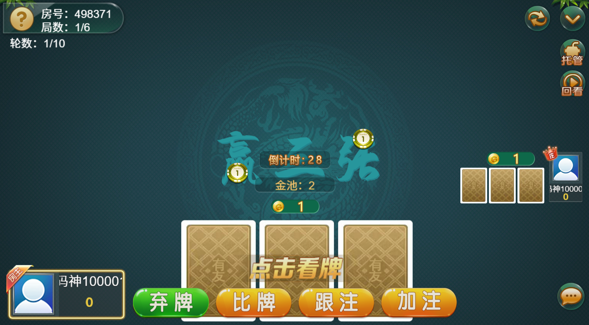
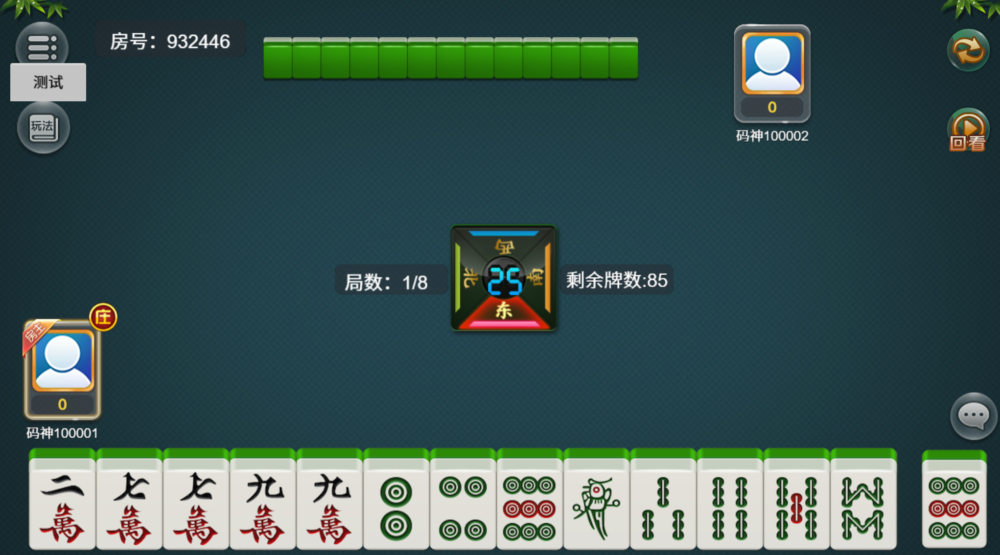
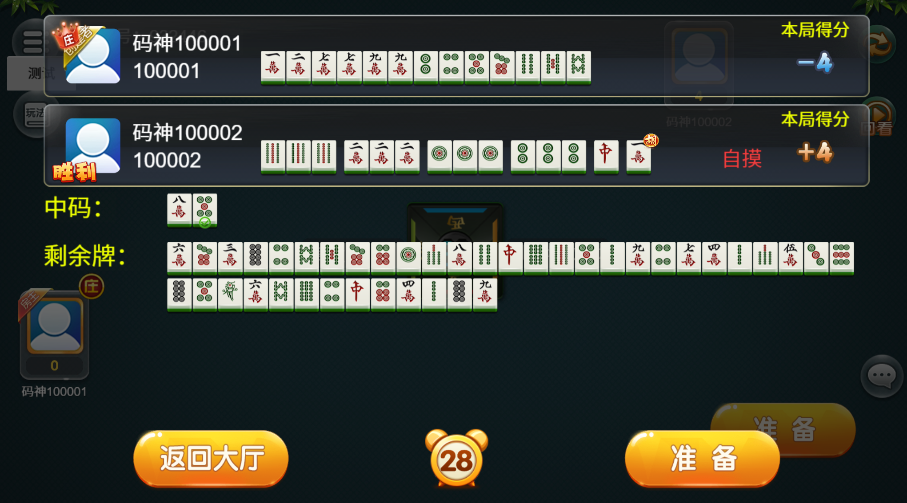
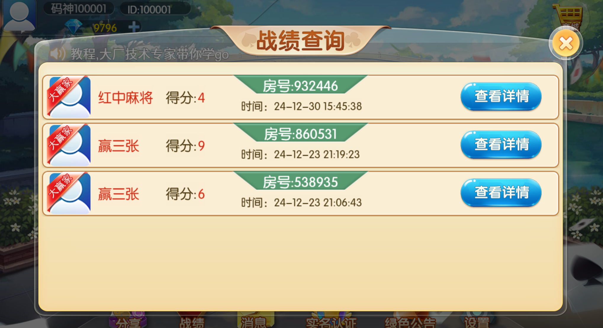

## 代码说明

> 该代码为`https://www.mszlu.com/docs/qp/01.html`棋牌项目的后端源码，教程购买可访问: `https://www.mszlu.com/course/detail/3`进行购买

* 购买项目可以加我V ：`mszlu521`
* 也可以通过`抖音`和`B站`搜索`码神之路`进入店铺或者课程专栏进行购买
* 本项目源码会持续更新，会对课程中的代码进行持续改进和完善
* 购买课程的`用户`可以克隆本项目做为参考

## 项目架构

## 项目特色

* 从零开发游戏框架
* 基于框架完成拼三张和红中麻将
* 分布式游戏框架，支持集群部署
* 可商用运行
* 提供前后端源码笔记视频和微信群答疑

## 面试介绍

项目描述：

基于房卡模式的棋牌游戏平台，涵盖了拼三张，红中麻将等多种游戏类型，从零开始设计并实现了完整的游戏后端框架，具备高可用行和高可扩展性，能够快速匹配同类型游戏的规则和玩法。

所用技术：

golang，自研游戏框架，mongo，redis，websocket，docker，k8s等

技术亮点：

* 从零开发了一套轻量级、高性能的游戏框架，模块化设计，支持快速接入新游戏
* 采用了websocket实时通信，pomelo通信协议，可集群化部署，实现了高并发通信
* 支持创建私人房间、好友邀请及亲友圈功能，提升了玩家的社交互动体验
* 完整实现了拼三张，麻将等的玩法，比如胡牌算法等
* MongoDB 和 Redis 实现游戏数据的高效存储与读取
* 服务拆分为网关、游戏逻辑、大厅管理，用户管理等多个微服务模块，提升了系统的灵活性与可维护性

项目成就：

* 系统稳定运行，支持数万在线用户
* 平均延迟控制在 50ms 以下，用户体验良好
* 模块化框架成功应用于多个类似项目，显著缩短了开发周期

## 声明

* 本源码只有购买了课程的用户具有完全的商业授权（可出售）
* 未购买课程的用户可以对源码进行学习和使用，禁止商用
