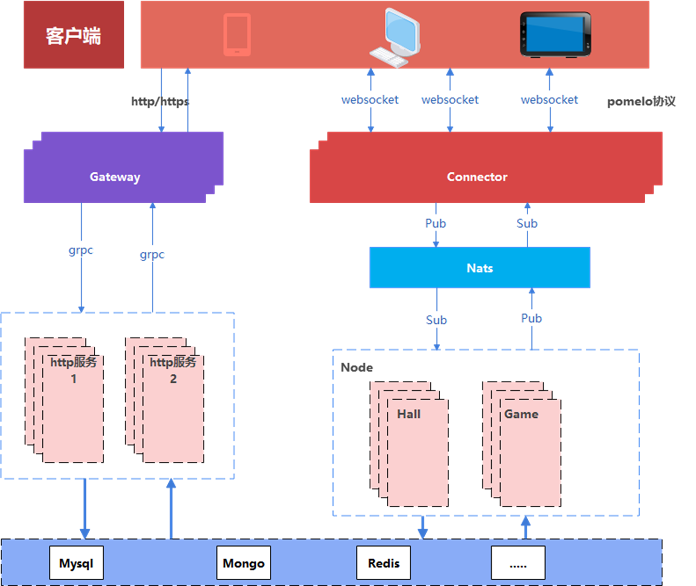

## 代码说明

> 该代码为`https://www.mszlu.com/docs/qp/01.html`棋牌项目的后端源码

* 购买项目可以加我`v18810639101`
* 也可以通过`抖音`和`B站`搜索`码神之路`进入店铺或者课程专栏进行购买
* 本项目源码会持续更新，会对课程中的代码进行持续改进和完善
* 购买课程的`用户`可以克隆本项目做为参考

## 项目架构

## 项目特色

* 从零开发游戏框架
* 基于框架完成拼三张和红中麻将
* 其余游戏会在本源码中陆续更新
* 分布式游戏框架，支持集群部署
* 提供前后端源码笔记视频和微信群答疑

## 声明

* 本源码只有购买了课程的用户具有完全的商业授权（可出售）
* 未购买课程的用户可以对源码进行学习和使用，禁止商用
